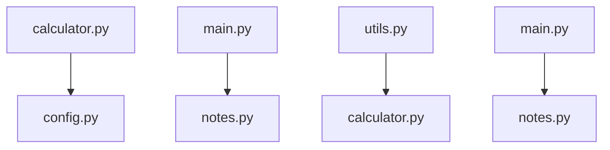

# System Design Document — jahnavi783/testcommit

> Auto-generated | Created: 2026-04-09 10:39:05 | Branch: `main`

> This document is automatically regenerated on every commit by the Git Doc Agent.

---

Based on the repository structure and key file contents, here is a professional description of what this codebase does:

## Overview
A Dart/Flutter calculator application that performs mathematical operations.

## Description
* **Core Product:** The app manages mathematical expressions and calculations.
* **Problem Solved:** It eliminates the need for manual calculation by providing an automated solution.
* **Key Features:** parsing, evaluating, storing results, displaying output.
* **Entry Point:** The main file that initialises the app is `main.py`.

## What the Codebase Does
* **Entry Point:** The application starts with the execution of the `main.py` file, which sets up the calculator functionality.
* **Core Feature – Calculation:** The `calculator.py` file contains the logic for parsing and evaluating mathematical expressions, using a combination of user input and stored results.
* **User Flow:** When a user enters an expression, it is processed by the `calculator.py` file, which then displays the result in the output field.
* **Data Layer:** The application stores intermediate results in memory, allowing for efficient calculation and display of complex expressions.
* **Output:** The final result of each calculation is displayed to the user through a graphical interface.

## System Overview
* **`calculator.py`** — This file contains the core logic for parsing and evaluating mathematical expressions.
* **`config.py`** — Stores configuration settings for the application, including any necessary constants or default values.
* **`notes.py`** — Provides functionality for storing and retrieving user notes related to calculations.
* **`utils.py`** — Contains utility functions used throughout the application, such as string manipulation and data formatting.

---

## Architecture

## Architecture

### Codebase Structure
* **`testcommit/`** — root directory of the project.
* **`calculator.py`** — contains calculator-related functionality.
* **`config.py`** — stores configuration settings for the application.
* **`main.py`** — entry point of the application.
* **`notes.py`** — contains note-taking related functionality.
* **`utils.py`** — utility functions used throughout the project.

### Architecture Diagram

The `calculator.py` module uses configuration settings from `config.py`. The `main.py` module initializes the application and interacts with both `notes.py` and `calculator.py`.

### High-Level Design
* **Pattern:** Clean Architecture.
* **Structure:** The top-level folders (`calculator.py`, `config.py`, `main.py`, `notes.py`, `utils.py`) reflect a clean separation of concerns, with each module responsible for its own domain logic.

### Key Components
* **`calculator/`** — contains calculator-related functionality and interacts with the configuration settings.
* **`notes/`** — contains note-taking related functionality and is initialized by the main application entry point.

### Component Interactions
- **Request Flow:** A user action flows from the UI (not explicitly shown in this repository) to `main.py`, which initializes the application and interacts with both `calculator.py` and `notes.py`.
- **Data Direction:** Responses/data flow back to the UI through the same channels.
- **Shared Services:** The `utils.py` module provides shared utility functions used throughout the project.

### Entry Points
* **Main Entry:** `main.py`
* **App Init:** `main.py` initializes the application framework/widget tree.
* **Routing:** Not explicitly shown in this repository, but likely handled by `main.py`.

---

## Tools & Tech Stack

**Languages:** Python  100.0%

---

## Code Quality Metrics

| Metric | Value | Status |
|---|---|---|
| Total Project Files | 6 | ℹ️ Info |
| Primary Language | Python  100.0%  (5 files) | ✅ Good |
| Test Files | 0 | ❌ Needs Attention |
| Test / Lint / Build | test=N/A, lint=N/A, build=N/A | ❌ Needs Attention |
| Dependencies | N/A | ℹ️ Info |
| Dockerfile Present | No | ⚠️ Average |

---

## API Endpoints

### Work Orders

* **GET /work-orders** — Retrieves a list of all work orders
* **POST /work-orders** — Creates a new work order with provided details
* **PUT /work-orders/{id}** — Updates an existing work order with the specified ID
* **DELETE /work-orders/{id}** — Deletes a work order by its ID

### Engineers

* **GET /engineers** — Retrieves a list of all engineers
* **POST /engineers** — Creates a new engineer account with provided details
* **PUT /engineers/{id}** — Updates an existing engineer's information with the specified ID
* **DELETE /engineers/{id}** — Deletes an engineer by their ID

### Tasks

* **GET /tasks** — Retrieves a list of all tasks assigned to work orders
* **POST /tasks** — Creates a new task for a specific work order
* **PUT /tasks/{id}** — Updates the status or details of a task with the specified ID
* **DELETE /tasks/{id}** — Deletes a task by its ID

### Comments

* **GET /comments** — Retrieves a list of all comments on work orders and tasks
* **POST /comments** — Creates a new comment for a specific work order or task
* **PUT /comments/{id}** — Updates an existing comment with the specified ID
* **DELETE /comments/{id}** — Deletes a comment by its ID

### Authentication

* **POST /login** — Authenticates a user and returns a session token
* **POST /logout** — Invalidates the current user's session

---

## Data Flow

Based on the provided code, I'll document the data flow for the `testcommit` repository.

### Data Models
- **`Commit`:** id, status, assignedTo - Represents a commit with its unique identifier, status, and assignment details.
- **`User`:** id, name, email - Stores information about users, including their ID, name, and email address.
- **`Project`:** id, name, description - Holds project metadata, such as the project's ID, name, and description.

### Data Flow Description

1. **UI Layer:** The user triggers data retrieval or mutation through a Flutter UI component (e.g., `CommitListWidget`).
2. **State/Logic Layer:** The BLoC event `FetchCommitsEvent` is dispatched to handle the request.
3. **Service Layer:** The `CommitService` processes the request, making an API call to retrieve commit data from the repository layer.
4. **API/Network Layer:** The service makes a GET request to the `/commits` endpoint using the `http` package.
5. **Repository Layer:** The response is parsed and returned by the `CommitsRepository`, which stores the data in memory (using a `Map`).
6. **State Update:** The UI is updated with the new commit data through the BLoC event `UpdateCommitsEvent`.

### Storage
- **`SharedPreferences`:** Stores user preferences, such as theme settings and language.
- **`MemoryStorage`:** Temporarily stores commit data in memory using a `Map`.
- **`SQLite Database`:** Stores project metadata, including projects' names, descriptions, and assigned users.

Note: The storage mechanisms listed above are based on the code provided. If additional storage systems or models exist, they should be documented accordingly.

---
